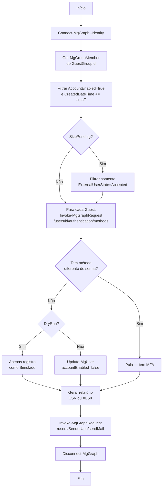

# Runbook-GuestsSemMfa

Runbook PowerShell para Azure Automation que **detecta e bloqueia automaticamente usuários Guest sem MFA** em um grupo específico do Microsoft Entra ID, gera relatório (CSV ou XLSX) e envia por e-mail via Microsoft Graph API.

[](https://docs.microsoft.com/en-us/powershell/)
[](https://azure.microsoft.com/en-us/services/automation/)
[](https://docs.microsoft.com/en-us/graph/)
[](#-licença)
[](#-changelog)
[](#-autor)

---

## 📋 Sumário

- [Visão geral](#-visão-geral)
- [Arquitetura](#-arquitetura)
- [Pré-requisitos](#-pré-requisitos)
- [Permissões necessárias](#-permissões-necessárias)
- [Módulos PowerShell](#-módulos-powershell)
- [Parâmetros](#-parâmetros)
- [Como funciona](#-como-funciona)
- [Instalação](#-instalação)
- [Uso](#-uso)
- [Output esperado](#-output-esperado)
- [Troubleshooting](#-troubleshooting)
- [Boas práticas](#-boas-práticas)
- [Changelog](#-changelog)
- [Contribuindo](#-contribuindo)
- [Licença](#-licença)
- [Autor](#-autor)

---

## 🎯 Visão geral

Este runbook automatiza a governança de **usuários convidados (Guest)** no Microsoft Entra ID, garantindo que somente convidados com MFA registrado permaneçam ativos. É executado em **Azure Automation** com **Managed Identity**, sem credenciais armazenadas.

### Funcionalidades

- ✅ Busca membros de um grupo específico do Entra ID (suporta grupos **dinâmicos e atribuídos**)
- ✅ Filtra Guests ativos criados antes de uma janela de tempo configurável
- ✅ Verifica métodos de autenticação **individualmente** via REST API (mais confiável que relatórios agregados)
- ✅ Bloqueia (`accountEnabled = false`) os Guests sem MFA
- ✅ Gera relatório em **XLSX** (com `ImportExcel`) ou **CSV** (fallback)
- ✅ Envia o relatório por e-mail com anexo via Microsoft Graph
- ✅ Suporta modo **DryRun** para simulação sem aplicar bloqueios
- ✅ Suporta múltiplos destinatários (To/Cc separados por `,` ou `;`)

---

## 🏗 Arquitetura

```
┌─────────────────────────────────────────────────────────────────┐
│                      Azure Automation Account                   │
│  ┌───────────────────────────────────────────────────────────┐  │
│  │              Runbook (PowerShell 5.1)                     │  │
│  │  ┌─────────────────────────────────────────────────────┐  │  │
│  │  │  1. Connect-MgGraph -Identity                       │  │  │
│  │  │  2. Get-MgGroupMember (grupo de Guests)             │  │  │
│  │  │  3. Invoke-MgGraphRequest (auth methods por user)   │  │  │
│  │  │  4. Update-MgUser (accountEnabled = false)          │  │  │
│  │  │  5. Export-Csv / Export-Excel                       │  │  │
│  │  │  6. Invoke-MgGraphRequest (sendMail)                │  │  │
│  │  └─────────────────────────────────────────────────────┘  │  │
│  └───────────────────────────────────────────────────────────┘  │
│                       │                                         │
│                       │ Managed Identity                        │
│                       ▼                                         │
└─────────────────────────────────────────────────────────────────┘
                        │
                        ▼
        ┌──────────────────────────────────┐
        │      Microsoft Graph API         │
        │  - GroupMember.Read.All          │
        │  - User.ReadWrite.All            │
        │  - UserAuthenticationMethod...   │
        │  - Mail.Send                     │
        │  - AuditLog.Read.All             │
        └──────────────────────────────────┘
```

---

## ✅ Pré-requisitos

| Recurso | Descrição |
|---|---|
| **Azure Automation Account** | Com **System-assigned Managed Identity** habilitada |
| **Microsoft Entra ID** | Tenant com grupo de Guests criado |
| **Permissões Graph** | Listadas na próxima seção (concedidas via Cloud Shell) |
| **Módulos PowerShell** | Microsoft.Graph.* (instalados na Automation Account) |
| **Mailbox remetente** | Caixa Exchange Online (usuário ou compartilhada) |
| **Privilégios admin** | Global Admin ou Privileged Role Administrator (para conceder permissões) |

---

## 🔐 Permissões necessárias

A **Managed Identity** da Automation Account precisa das seguintes **Application Permissions** no Microsoft Graph:

| Permissão | Justificativa |
|---|---|
| `GroupMember.Read.All` | Listar membros do grupo de Guests |
| `User.ReadWrite.All` | Ler propriedades e desabilitar (`accountEnabled=false`) |
| `UserAuthenticationMethod.Read.All` | Verificar métodos MFA por usuário |
| `AuditLog.Read.All` | (Reserva) leitura de logs de autenticação |
| `Mail.Send` | Envio do relatório por e-mail |

### Conceder permissões via Cloud Shell

```powershell
# Substitua "aa-disablegueusers" pelo nome da sua Automation Account
$miObjectId = (Get-AzADServicePrincipal -DisplayName "aa-disablegueusers").Id
$graphSP    = Get-AzADServicePrincipal -Filter "displayName eq 'Microsoft Graph'"

$permissions = @(
    "GroupMember.Read.All",
    "AuditLog.Read.All",
    "Mail.Send",
    "User.ReadWrite.All",
    "UserAuthenticationMethod.Read.All"
)

foreach ($permName in $permissions) {
    $role = $graphSP.AppRole | Where-Object { $_.Value -eq $permName }
    if ($role) {
        try {
            New-AzADServicePrincipalAppRoleAssignment `
                -ServicePrincipalId $miObjectId `
                -ResourceId $graphSP.Id `
                -AppRoleId $role.Id
            Write-Output "OK: $permName"
        } catch {
            Write-Output "Já existe ou falhou: $permName - $($_.Exception.Message)"
        }
    }
}
```

> ⚠️ Tokens da Managed Identity são cacheados — após conceder novas permissões, aguarde **15-60 minutos** para propagação.

---

## 📦 Módulos PowerShell

Instale via **Automation Account → Shared Resources → Modules → Browse gallery**, na ordem:

1. `Microsoft.Graph.Authentication`
2. `Microsoft.Graph.Users`
3. `Microsoft.Graph.Groups`
4. `Microsoft.Graph.Reports`
5. `Microsoft.Graph.Users.Actions`
6. `ImportExcel` *(opcional — para gerar relatório em XLSX)*

> 🔧 **Runtime version: 5.1**

---

## ⚙️ Parâmetros

| Parâmetro | Tipo | Padrão | Descrição |
|---|---|---|---|
| `HoursWithoutMfa` | `int` | `24` | Janela em horas. Considera Guests criados há **pelo menos** este número de horas |
| `SkipPending` | `bool` | `$false` | Se `$true`, ignora Guests com convite pendente (`PendingAcceptance`) |
| `GuestGroupId` | `string` | *Object ID* | Object ID do grupo do Entra ID contendo os Guests a avaliar |
| `SenderUpn` | `string` | UPN do remetente | UPN da mailbox que enviará o relatório |
| `To` | `string` | Destinatários | Destinatários do relatório (separados por `,` ou `;`) |
| `Cc` | `string` | *(opcional)* | Destinatários em cópia (separados por `,` ou `;`) |
| `Subject` | `string` | Assunto padrão | Assunto do e-mail |
| `DryRun` | `bool` | `$false` | Se `$true`, simula a execução sem aplicar bloqueios |

---

## 🔄 Como funciona



---

## 📥 Instalação

Consulte o **[Guia de Implantação Passo a Passo](./IMPLANTACAO.md)** para instruções detalhadas.

Resumo:

1. Criar Automation Account com Managed Identity
2. Instalar módulos Microsoft.Graph.*
3. Conceder permissões Graph à Managed Identity (Cloud Shell)
4. Criar Runbook PowerShell e colar o conteúdo de `Runbook-GuestsSemMfa.ps1`
5. **Save** e **Publish**
6. Configurar parâmetros default
7. Criar Schedule e linkar ao Runbook

---

## 🚀 Uso

### Teste manual (DryRun)

No Test Pane, configurar:

```
HoursWithoutMfa : 1
SkipPending     : False
GuestGroupId    : <Object ID do grupo>
SenderUpn       : noreply@seudominio.com
To              : secops@seudominio.com
DryRun          : True
```

### Execução agendada (produção)

Recomendado: **diária às 02:00 BRT** com `DryRun=False` e `SkipPending=True`.

### Execução via API

```powershell
Start-AzAutomationRunbook `
    -AutomationAccountName "aa-disablegueusers" `
    -ResourceGroupName "rg-governance" `
    -Name "RumGuestDisable" `
    -Parameters @{
        HoursWithoutMfa = 24
        SkipPending     = $true
        GuestGroupId    = "xxxxxxxx-xxxx-xxxx-xxxx-xxxxxxxxxxxx"
        DryRun          = $false
    }
```

---

## 📊 Output esperado

```
=== Início do runbook (06/06/2026 15:14:20) ===
Janela sem MFA: 48 h | SkipPending: False | DryRun: False
ImportExcel NÃO disponível: relatório será gerado em .csv (fallback).
Conectando ao Microsoft Graph com Managed Identity...
Data/hora de corte: 06/04/2026 15:14:25
Listando convidados (Guest) do tenant...
Buscando membros do grupo 'e085a063-815d-4f53-b603-bec1b12806d1'...
Total de convidados considerados após filtro: 1
Verificando métodos de autenticação de cada convidado...
  SEM MFA: analistaerickbm_gmail.com#EXT#@erickbmhotmail.onmicrosoft.com
Candidatos a bloqueio (sem MFA e dentro da janela): 1
Total processado: 1 | Bloqueados/Simulados: 1
Relatório gerado (CSV): C:\Users\ContainerUser\AppData\Local\Temp\GuestsBloqueados_20260606_151432.csv
Preparando e-mail para 2 destinatário(s)...
E-mail enviado a partir de 'noreply@seudominio.com'.
=== Fim do runbook (06/06/2026 15:14:32) ===
```

### Conteúdo do relatório

| DisplayName | UserPrincipalName | CreatedDateTime | ExternalUserState | Action | ActionDateTimeUtc |
|---|---|---|---|---|---|
| Erick Teste | analistaerickbm_gmail.com#EXT#@... | 6/3/2026 7:28:10 PM | PendingAcceptance | Bloqueado | 6/6/2026 3:14:31 PM |

---

## 🩺 Troubleshooting

| Erro | Causa | Solução |
|---|---|---|
| `Cmdlet 'Connect-MgGraph' not recognized` | Módulos Graph não instalados | Instale os módulos `Microsoft.Graph.*` na Automation Account |
| `Cannot convert value "System.String" to SwitchParameter` | Test Pane não suporta `[switch]` | Parâmetros já usam `[bool]` — confirme que está rodando a versão atual |
| `403 Forbidden — Insufficient privileges` | Permissão Graph faltando | Conceda permissão via Cloud Shell e aguarde propagação |
| `403 Forbidden` mesmo com permissão concedida | Token MI em cache | Aguarde 15-60 minutos após conceder permissões |
| `400 Bad Request` no sendMail | JSON malformado | Já corrigido com `ConvertTo-Json -Depth 20` |
| `Total de convidados: 0` | Filtro `CreatedDateTime` ou `AccountEnabled` removeu | Reduza `HoursWithoutMfa` ou verifique o estado dos Guests |
| Relatório sempre em CSV | `ImportExcel` não instalado | Instale o módulo (opcional) |

---

## ✨ Boas práticas

- ✅ Sempre testar com `DryRun=True` antes de habilitar bloqueios reais
- ✅ Configurar **alertas** no Automation Account para jobs com status `Failed`
- ✅ Usar **agendamento diário** em janela fora do horário comercial (ex: 02:00 BRT)
- ✅ Considerar uso de **Conditional Access** como camada complementar
- ✅ Manter inventário de Guests com revisão periódica via **Access Reviews**
- ✅ Documentar internamente as permissões concedidas à MI para auditoria
- ✅ Revisar logs do Runbook regularmente em **Automation Account → Jobs**

---

## 📜 Changelog

### v2.0 — 2026-06-06

Refatoração completa do script base com melhorias estruturais, de confiabilidade e de governança.

#### 🔄 Breaking changes

- **Filtro de Guests** alterado de **sufixo de UPN hardcoded** para **membership de grupo do Entra ID** (suporta grupos dinâmicos e atribuídos).
- Parâmetros `$SkipPending` e `$DryRun` migrados de `[switch]` para `[bool]` — necessário para compatibilidade com o **Test Pane do Azure Automation**, que não suporta switches corretamente.

#### ✨ Adicionado

- Novo parâmetro obrigatório `$GuestGroupId` (Object ID do grupo).
- Parametrização completa de **remetente** (`SenderUpn`) e **destinatários** (`To`, `Cc`), eliminando valores hardcoded.
- Módulo `Microsoft.Graph.Groups` adicionado às dependências.
- Permissão `UserAuthenticationMethod.Read.All` adicionada à Managed Identity.
- Output detalhado linha-a-linha com indicação `SEM MFA` / `COM MFA` por usuário, facilitando troubleshooting.

#### 🔧 Alterado

- **Verificação de MFA** migrada de relatório agregado (`Get-MgReportAuthenticationMethodUserRegistrationDetail`) para chamadas **per-user** via `Invoke-MgGraphRequest` ao endpoint `/users/{id}/authentication/methods`.
  > **Motivo:** o relatório agregado não cobre Guests recém-criados ou que nunca fizeram sign-in, gerando falsos negativos.
- **Envio de e-mail** migrado de `Send-MgUserMail` (SDK cmdlet) para `Invoke-MgGraphRequest` com `ConvertTo-Json -Depth 20`.
  > **Motivo:** o cmdlet apresentava erros 403 inconsistentes e problemas de serialização de hashtables aninhadas em runbook.

#### 🐛 Corrigido

- Problema de serialização de JSON no payload de e-mail (`StartObject node was found where PrimitiveValue was expected`).
- Falsos negativos na detecção de Guests sem MFA.
- Incompatibilidade de parâmetros `[switch]` com o painel de teste do Azure Automation.

### v1.0 — Versão inicial (modelo base)

- Filtro de Guests por sufixo de UPN hardcoded.
- Verificação de MFA via relatório agregado do Graph.
- Envio de e-mail via `Send-MgUserMail` (SDK).
- Destinatários e remetente hardcoded no script.

---

## 🤝 Contribuindo

Contribuições são bem-vindas! Para contribuir:

1. Fork este repositório
2. Crie uma branch para sua feature (`git checkout -b feature/nova-funcionalidade`)
3. Commit suas alterações (`git commit -m 'Adiciona nova funcionalidade'`)
4. Push para a branch (`git push origin feature/nova-funcionalidade`)
5. Abra um **Pull Request**

Para reportar bugs ou sugerir melhorias, abra uma **issue** descrevendo o problema ou a sugestão.

---

## 📄 Licença

Distribuído sob a licença **MIT**. Uso livre com atribuição ao autor original.

---

## 👤 Autor

**Erick Medeiros**
*Microsoft MVP — Azure*

Especialista em administração Azure, arquitetura Microsoft 365 e automação de infraestrutura cloud com foco em segurança e governança de identidade.

- 🏆 Microsoft Most Valuable Professional (MVP) — Microsoft Azure
- ☁️ Áreas de atuação: Azure/Entra ID, PowerShell Automation, M365 Security Architecture

---

## 🙏 Agradecimentos

Solução desenvolvida com base em cenários reais de governança de identidade Microsoft 365, focada em hardening de segurança e automação de operações repetitivas.

---

*Última atualização: 06 de junho de 2026*
